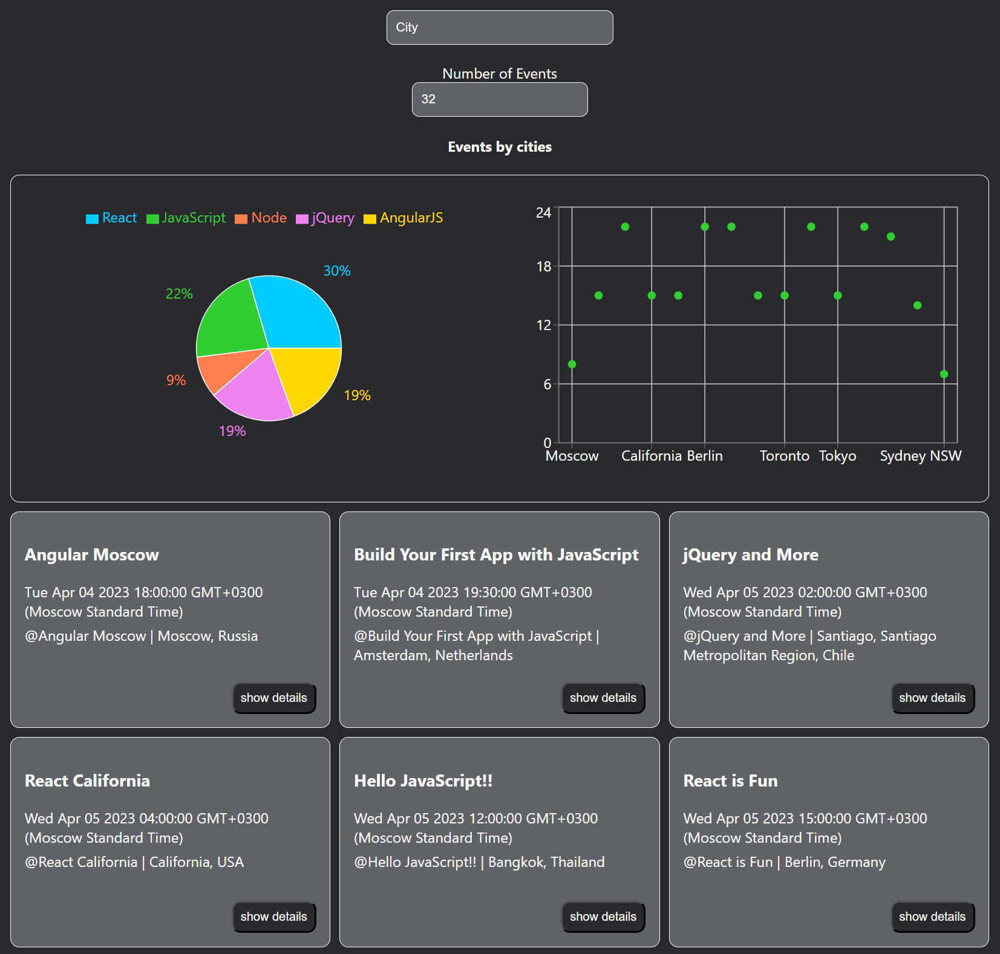
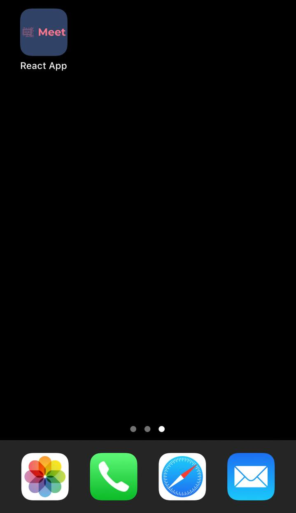

# Meet App

## Description

Introducing an innovative serverless Progressive Web Application (PWA) developed with a Test-Driven Development (TDD) approach, leveraging the power of React. This cutting-edge application seamlessly integrates with the Google Calendar API to retrieve and display upcoming full-stack meetup events, catering to the needs of today's dynamic business environment.

Meet App was built using [GitHub Pages](https://pages.github.com/).

[LIVE DEMO](https://ecspecial.github.io/meet/)



## Access to the Meet App

The live app is currently in "testing" and hasn't been verified by Google. If you'd like full access, please get in touch to add you as a tester. A Google account is required, as the app utilizes Google OAuth2 for authentication.

As a progressive web app, it can be installed natively on any device, offering seamless functionality and an enhanced user experience.



### Run locally

Clone the repository and start with commands below:

```shell
git clone https://github.com/ecspecial/meet.git
cd meet
npm install
npm run start
```

## Features

- Serverless functions (AWS Lambda) for the authorization server instead of using a traditional server
- OAuth2 login with Google account
- TDD Unit and Integration tests written with Jest
- BDD style User Acceptance tests written with Jest-Cucumber
- End-to-End tests written with Puppeteer
- Data visualization with Recharts
- Progressive Web Application
- Bootstrap as a UI library for styling and responsiveness

## Technologies

### Frontend
- React
- Recharts

### Data and authentication
- Axios
- AWS Lambda
- Google OAuth2
- Google Calendar API

### Testing
- Jest
- Jest-Cucumber
- Enzyme
- Puppeteer
- Atatus